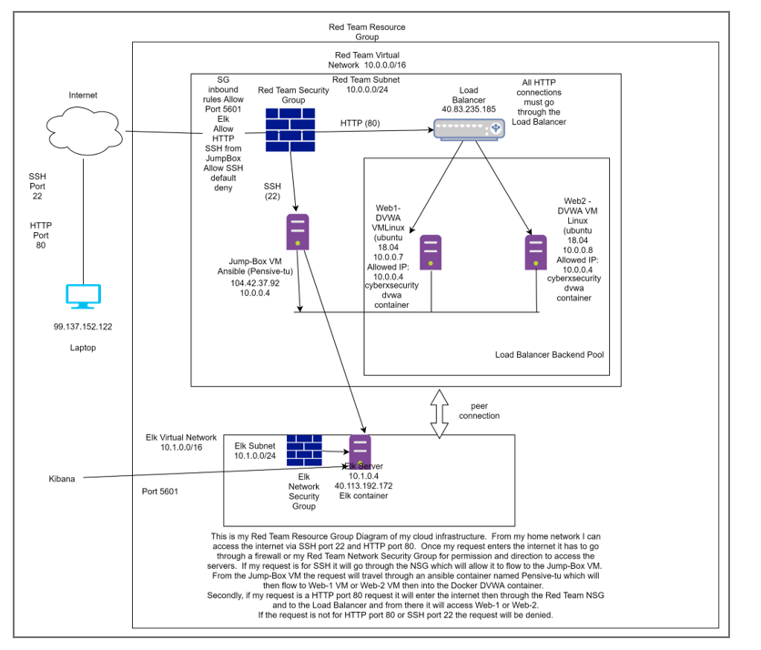
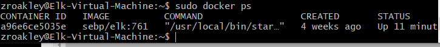
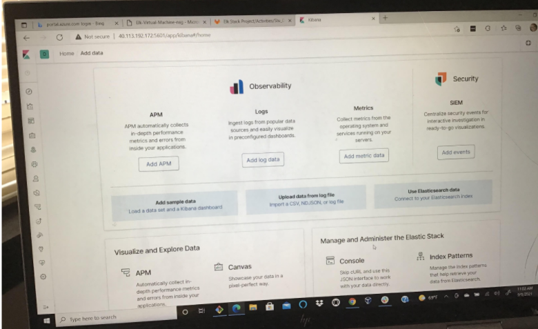
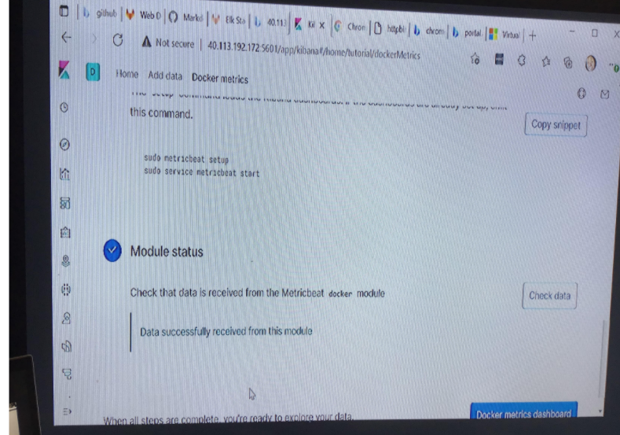

## Automated ELK Stack Deployment

The files in this repository were used to configure the network depicted below.

These files have been tested and used to generate a live ELK deployment on Azure. They can be used to either recreate the entire deployment pictured above. Alternatively, select portions of the .yml file may be used to install only certain pieces of it, such as Filebeat.

  -etc/ansible/elk-yml

This document contains the following details:
- Description of the Topology
- Access Policies
- ELK Configuration
  - Beats in Use
  - Machines Being Monitored
- How to Use the Ansible Build

### Description of the Topology

The main purpose of this network is to expose a load-balanced and monitored instance of DVWA, the D*mn Vulnerable Web Application.

Load balancing ensures that the application will be highly available and secure, in addition to restricting access to the network.
- What aspect of security do load balancers protect? What is the advantage of a jump box?_ The load balancers are devices that distribute application and network traffic across multiple servers and act as a reverse proxy.  It protects the servers from DDoS attacks by moving suspicious traffic.  The advantage of a jump box is that it assists organizations in decreasing vulnerabilities or risk to their network by securing the servers by being a pathway before unsecure traffic can access the servers.

Integrating an ELK server allows users to easily monitor the vulnerable VMs for changes to the data and system logs.
-  What does Filebeat watch for? Filebeat watches for log files or locations and collects log events, and forwards them either to Elasticsearch or Logstash for indexing.
-  What does Metricbeat record? Metricbeat records statistics and metrics that have been collected from the system and services running on the server.

The configuration details of each machine may be found below.
_Note: Use the [Markdown Table Generator](http://www.tablesgenerator.com/markdown_tables) to add/remove values from the table_.

| Name     | Function | IP Address | Operating System    |
|----------|----------|------------|---------------------|
| Jump Box | Gateway  | 10.0.0.4   | Linux (ubuntu 18.04)|
| Web1-DVWA| Webserver| 10.0.0.7   | Linux (ubuntu 18.04)|
| Web2-DVWA| Webserver| 10.0.0.8   | Linux (ubuntu 18.04)|
| Elk      | Webserver| 10.1.0.4   | Linux (ubuntu 18.04)|

### Access Policies

The machines on the internal network are not exposed to the public Internet. 

Only the jump box machine can accept connections from the Internet. Access to this machine is only allowed from the following IP addresses: 2
- Add whitelisted IP addresses_laptop IP address - 99.137.152.122

Machines within the network can only be accessed by jump box.
- _TODO: Which machine did you allow to access your ELK VM? What was its IP address?_ The machine that was allowed access to the Elk VM (10.1.0.4) was the jump box (10.0.0.4) via SSH port 22.

A summary of the access policies in place can be found in the table below.

| Name     | Publicly Accessible | Allowed IP Addresses |
|----------|---------------------|----------------------|
| Jump Box | No                  | 10.0.0.4             |
| Web1-DVWA| No                  | 10.0.0.7             |
| Web2-DVWA| No                  | 10.0.0.8             |
| Elk      | No                  | 10.1.0.4             |

### Elk Configuration

Ansible was used to automate configuration of the ELK machine. No configuration was performed manually, which is advantageous because...
- What is the main advantage of automating configuration with Ansible?_ The main advantage of automating configuration with Ansible is it saves time by automating installation of packages and configuration of large numbers of servers compares to a manual process.  The playbooks are what makes this happen.

The playbook implements the following tasks:
- _TODO: In 3-5 bullets, explain the steps of the ELK installation play. E.g., install Docker; download image; etc._
- ... Create Elk Server
- ... Install docker.io
- ... Install pip3
- ... Install Docker python module
- ... Download and Launch Docker - elk-docker
- ... Access management - connect to Elk via HTTP and view it through the browser

The following screenshot displays the result of running `docker ps` after successfully configuring the ELK instance.

### Target Machines & Beats
This ELK server is configured to monitor the following machines:
- List the IP addresses of the machines you are monitoring_
  - web1: 10.0.0.7
  - web2: 10.0.0.8

We have installed the following Beats on these machines:
- Specify which Beats you successfully installed_
 - Filebeat and Metricbeat

These Beats allow us to collect the following information from each machine:
- In 1-2 sentences, explain what kind of data each beat collects, and provide 1 example of what you expect to see. E.g., `Winlogbeat` collects Windows logs, which we use to track user logon events, etc._
 - Filebeat collects log data, for example Elasticsearch handles audit logs, depreciatioin logs, gc logs, server logs and slow logs.
 - Metricbeat collects metrics from the operating system and from services running on the server.  This information is sent to Elasticsearch or Logstash.  Collect from Redis or MySQL.

### Using the Playbook
In order to use the playbook, you will need to have an Ansible control node already configured. Assuming you have such a control node provisioned: 

SSH into the control node and follow the steps below:
- Copy the Filebeat.yml and metribeat.yml file to /etc/ansible/.
- Update the hosts file to include the host IP address in filebeat,yml file.
- Run the playbook, and navigate to Kibana to check that the installation worked as expected.

_TODO: Answer the following questions to fill in the blanks:_
- _Which file is the playbook? Where do you copy it?_ The file is filebeat-playbook.yml and is copied to /etc/ansible/hosts/ directory.
- _Which file do you update to make Ansible run the playbook on a specific machine? How do I specify which machine to install the ELK server on versus which to install Filebeat on? The file you update to make Ansible run the playbook on a specific machine is filebeat.yml.  This is the configuration file that will be loaded into the Elk-Server for the ansible-playbook to run.  Then you update the host.config.file in the ansible directory.  Create a new group (elk-servers) and add the private IP address of the Elk-Server (10.1.0.4) to the group.  After configuring the filebeat.yml file add the private ip address sof the Elk-Server in lines 1106 and 1806.
- _Which URL do you navigate to in order to check that the ELK server is running? The URL used to check that the Elk-Srver is running is http://40.113.192.172:5601/app/kibana

_As a **Bonus**, provide the specific commands the user will need to run to download the playbook, update the files, etc._
 - ssh@jumpbox 10.0.0.4
 - sudo docker container list -a
 - sudo docker start container
 - sudo docker attach container
 - cd /etc/ansible/roles
 - Ansible-playbook filebeat-playbook.yml
 - open a new web browser http://40.113.192.172:5601/app/kibana 

